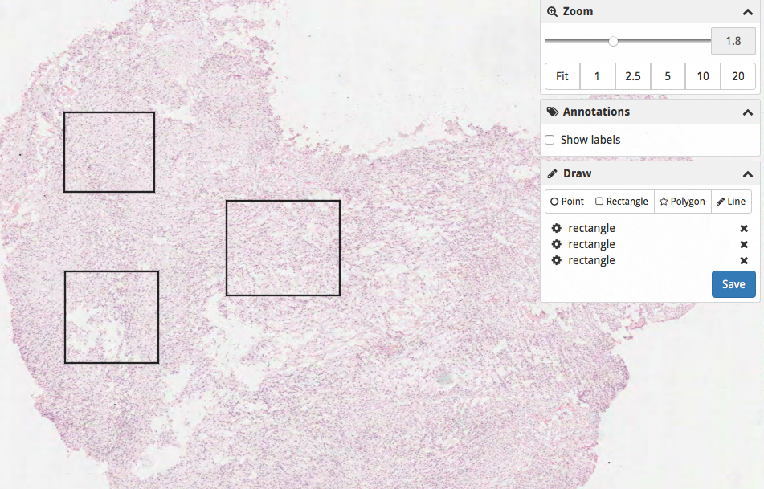
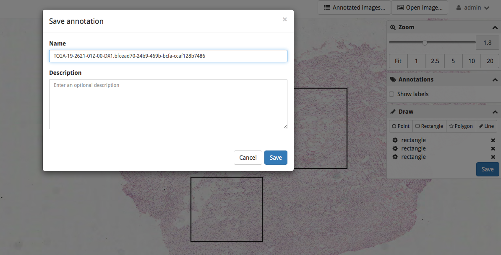
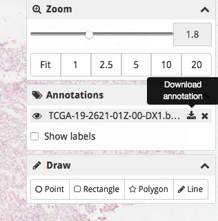

# GBM easy mining of ROIs from svs images

The main provider for the web-app is HistomicsTK ([GitHub link](https://github.com/DigitalSlideArchive/HistomicsTK))

1. Instructions for installing the app can be found [here](https://digitalslidearchive.github.io/HistomicsTK/). They provide three ways for installing the app, via Vagrant, via Docker or via local deployment. Local deployment should work on Ubuntu systems only. Docker or Vagrant should work with any system since they make use of virtual machines. I suggest using Docker.

2. Once installed, the webapp can be accessed from http://localhost:8080/
  1. Use the [Collections](http://localhost:8080/girder#collections) option to upload a set of .svs images
  2. Create a new collection
  3. Create a new folder inside the collection
  4. Upload the images
  5. Go to the HistomicsTK [module](http://localhost:8080/histomicstk)
  6. Open an image from the collection created
  7. Draw a set of rectangles for selecting the ROIs 
  8. Once done click on Save. IMPORTANT, use the name of the image as name for the annotation.
  `TO SOLVE: saddly I have not find any better way to associate the file name to the annotation. Each image has an internal unique id in the webapp but I cannot locate the point where the internal id is matched with the original file name.`
  
  9. Click on download annotation

  

3. Once collected the set of annotations we can easily select the region of interests with the script `extract_rois.py`
  1. The script requires basic python libraries like `numpy, os, json`
  2. It also requires bfconvert. Instructions for using the command line tool can be found [here](https://docs.openmicroscopy.org/bio-formats/5.8.1/users/comlinetools/index.html). Everything is provided in the github folder thought and no additional steps are required for installing the tool.
